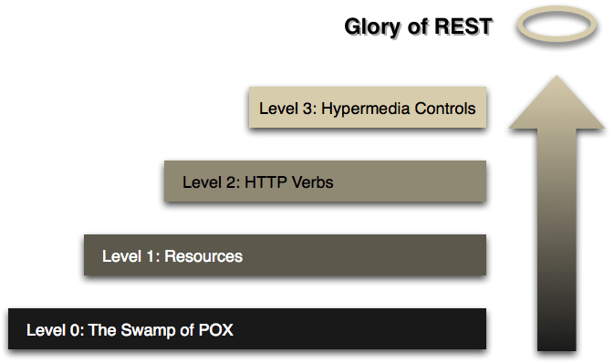
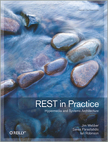

# Fünftägiger ASP.NET MVC Workshop
Ihr Trainer: [Johannes Hoppe](http://www.haushoppe-its.de) von der [conplement AG](http://www.conplement.de/)

## Tag 1 - Agenda

1. [Anlegen eines ASP.NET Web API Projekts (Routing, Bundling)](#projekt)
2. [Anlegen von DTOs / POCOs (Geschäftsobjekte)](#poco)
3. [IoC, Dependency Injection](#ioc)
4. [Einrichten von Entity Framework, Code First](#ef)
5. [Web API Controller](#controller)
6. [Refactoring zu Repository](#repository)
7. [REST & Hypermedia](#rest)


## Aufgaben:
1. Erstelle eine Projekt mit Nuget
2. Implementiere IoC mit Autofac
3. Lege einen Web API Controller an
4. Lade Daten per $.get und $.post
5. **Erstelle das CustomerRepository** (Verwende IoC)


<a name="projekt"></a>
## 1. Anlegen eines ASP.NET Web API Projekts

Wir verwenden folgendes Projekt-Template aus Visual Studio:
File > New > Project > Templates > Visual C# > Web > **"ASP.NET Web Application"**


Dabei wählen wir ein Web API Projekt aus:


Wir besprechen folgende Ordner:

1. Models
2. Views
3. Controllers

sowie

1. Content
2. Scripts


<a name="poco"></a>
## 2. Anlegen von DTOs / POCOs (Geschäftsobjekte)

Wir werden einfache "Data Transfer Objekte" (DTO) bzw. "Plain Old CLR Objects" (POCO) verwenden. Hiermit können wir die Daten unserer "Geschäftslogik" halten. Es gibt verschiedene Architektur-Stile, bei vielen sollten "Geschäftsobjekte" nicht nur Daten sondern auch Methoden besitzen. Für eine einfache Anwendung ist es absolut ausreichend, nicht zwischen "Entitäten" (ein Begriff des [Domain Driven Designs](http://dddcommunity.org/) von Eric Evans) und zwischen DTOs / POCOs zu unterscheiden. Wir verwenden die POCOs direkt und hauchen Ihnen später etwas Leben ein - mithilfe des Entity Frameworks. Es ist aber wichtig zu erkennen, das wir dadurch ein "**Anemic** domain model" erstellen. Dieses gilt als Anti-Pattern im Sinne des Domain Driven Designs. Die Verwendung des Entity Frameworks garantiert übrigens nicht, das wir nun Entitäten im Sinne von Domain Driven Design besitzen. Der Begriff ist hier doppeldeutig.

Es gibt somit die Entität "Kunde", welche eine beliebige Anzahl an Rechnungen besitzen kann:

```csharp
public class Customer
{
    public Customer()
    {
        Invoices = new List<Invoice>();
    }

    public int Id { get; set; }
    public string FirstName { get; set; }
    public string LastName { get; set; }
    public string Mail { get; set; }
    public DateTime DateOfBirth { get; set; }
    public virtual ICollection<Invoice> Invoices { get; set; }
}

public class Invoice
{
    public int Id { get; set; }
    public decimal Amount { get; set; }

    public int CustomerId { get; set; }                     
    public virtual Customer Customer { get; set; } 
}


```


<a name="ioc"></a>
## 3. IoC / Dependency Injection

Der Begriff "**Inversion of Control**" bezeichnet ein Umsetzungsparadigma, bei dem die Kontrolle über die Instanzierung von Objekten nicht mehr der verwendeten Klassen obliegt. Statt dessen wird die "Kontrolle" umgekehrt, d.h. die verwendende Klasse bekommt das zu verwendende Objekt durch eine andere Kontrolleinheit. Konkret verwenden wir das "**Dependency Injection**"-Prinzip, welches eine besonders beliebte Ausprägung von IoC ist. Üblicherweise verwendet man einen existierenden IoC-Container, welcher viel Arbeit abnehmen kann. Eine Empfehlung ist das Framework Autofac:

```csharp
public class IocConfig
{
    public static void Register()
    {
        var builder = new ContainerBuilder();

        // Registers all ASP.NET MVC controllers
        builder.RegisterControllers(Assembly.GetExecutingAssembly());

        // Registers all Web API controllers
        builder.RegisterApiControllers(Assembly.GetExecutingAssembly());
           
        // All other types to register
        builder.RegisterType<DataContext>().InstancePerRequest();

        var container = builder.Build();

        // Set the dependency resolver for MVC
        var mvcResolver = new AutofacDependencyResolver(container);
        DependencyResolver.SetResolver(mvcResolver);

        // Set the dependency resolver for Web API.
        var webApiResolver = new AutofacWebApiDependencyResolver(container);
        GlobalConfiguration.Configuration.DependencyResolver = webApiResolver;
    }
}

```


<a name="ef"></a>
## 4. Einrichten von Entity Framework, Code First

Als Data Access Layer (DAL) verwenden wir das Entitiy Framework, dessen in frühere Versionen Teil des .NET Framework sind. Die neueste Versionen sind nun direkt per [Nuget](https://www.nuget.org/packages/entityframework) verfügbar.  
Bitte beachten Sie, dass die feste Verdrahtung der Geschäftslogik mit einem Objektrelationen Mapper bei einer größeren Anwendung sorgfältig geprüft werden sollte!

Um mit dem Code-First Ansatz zu starten, ist es notwendig eine Klasse zu erstellen, welche von System.Data.Entity.DbContext erbt. Hier geben wir alle vom EF zu berücksichtigen POCOs an. Der Rest geschieht weitgehend über den "Convention over Configuration" Ansatz.

```csharp
public class DataContext : DbContext
{
    public DbSet<Customer> Customers { get; set; }
    public DbSet<Invoice> Invoices { get; set; }

    protected override void OnModelCreating(DbModelBuilder modelBuilder)
    {
        modelBuilder.Configurations.Add(new InvoiceMap());
    }
}
```

Natürlich darf man einen passenden Connection-String nicht vergessen:

```xml
<connectionStrings>
    
    <!-- Beispiel 1 -->
    <add name="DefaultConnection" connectionString="Data Source=(local);Initial Catalog=TestDb;Integrated Security=SSPI;" providerName="System.Data.SqlClient" />

    <!-- Beispiel 2 -->
    <add name="DefaultConnection" connectionString="Data Source=(LocalDb)\v11.0;AttachDbFilename=|DataDirectory|\TestDb.mdf;Initial Catalog=TestDb;Integrated Security=True" providerName="System.Data.SqlClient" />

</connectionStrings>
```


### 4.1 Mockbarer Context per Interface (ab EF5)

Ein klassischer Weg zu "Ausmocken" von Objekten ist die Verwendung von Interfaces:


```csharp
public class DataContext : DbContext, IDataContext
{
    /* [...] */
}

public interface IDataContext
{
    IDbSet<Customer> Customers { get; set; }
    IDbSet<Invoice> Invoices { get; set; }

    int SaveChanges();
}

```

Das originale DbSet implementiert bereits das Interface IDbSet.
Als Ersatz bei Unit-Tests empfehle ich zum Beispiel folgendes In-Memory-Dbset:
https://www.nuget.org/packages/FakeDbSet/

Zusammen mit dem Mocking-Framework [Moq](https://github.com/Moq/moq4) können wir so sehr leicht IDbSet (durch FakeDbSet) und IMyContext (durch Moq) wie folgt ersetzen:

```csharp
InMemoryDbSet<Customer> inMemoryDbSet = new InMemoryDbSet<Customer>(true);

var mockedContext = new Mock<IMyContext>();
mockedContext.Setup(m => m.Customers).Returns(inMemoryDbSet);
repository = new CustomerRepository(mockedContext.Object);

```


### 4.2 Mockbarer Context per Override (ab EF6)

Version 6 des Entity Framework ist direkt mit Objekten im Arbeitsspeicher testbar. Für die Version 5 des Entity Frameworks war es noch zwingend notwendig, das Objekt mit einem Interface zu maskieren. Seit Version 6 ist kein zusätzliches Interface notwendig, es da alle relevanten Properties von `DbSet<T>` als virtuell markiert wurden. 

Folgender Quelltext demonstriert einen solchen Unit-Test, welcher eine simple Liste verwendet. Der Test soll beweisen, dass tatsächlich alle vorhanden Kunden-Entitäten von der Methode `GetCustomers` berücksichtigt werden. In diesem Beispiel wird das Unit-Test Framework "Machine.Specifications" (MSpec) verwendet. MSpec kann direkt über Nuget bezogen werden. Die Syntax von MSpec ermöglicht gut lesbare Tests im "Behavior-Driven Development" (BDD) Stil.  

Das Framework "Fluent Assertions" stellt die Erweiterungs-Methode "Should()" bereit. Als Mocking-Framework wird "NSubstitute" eingesetzt. 

```

// Moq
[Subject(typeof(CustomersApiController))]
public class When_getting_customers_using_Moq
{
    static CustomersController controller;
    static IQueryable<Customer> result;

    Establish context = () =>
        {
            var data = new List<Customer> 
            { 
                new Customer { FirstName = "Test1" }, 
                new Customer { FirstName = "Test2" } 
            }.AsQueryable();

            var mockSet = new Mock<DbSet<Customer>>();
            mockSet.As<IQueryable<Customer>>().Setup(m => m.Provider).Returns(data.Provider);
            mockSet.As<IQueryable<Customer>>().Setup(m => m.Expression).Returns(data.Expression);
            mockSet.As<IQueryable<Customer>>().Setup(m => m.ElementType).Returns(data.ElementType);
            mockSet.As<IQueryable<Customer>>().Setup(m => m.GetEnumerator()).Returns(data.GetEnumerator());

            var mockContext = new Mock<DataContext>();
            mockContext.Setup(c => c.Customers).Returns(mockSet.Object);

            controller = new CustomersController(mockContext.Object);
        };

    Because of = () => result = controller.GetCustomers();

    It should_return_all_customers = () => result.Count().Should().Be(2);
}


// NSubstitute
[Subject(typeof(CustomersController))]
public class When_getting_customers
{
    static CustomersController controller;
    static IQueryable<Customer> result;

    Establish context = () =>
        {
            var data = new List<Customer> 
            { 
                new Customer { FirstName = "Test1" }, 
                new Customer { FirstName = "Test2" } 
            }.AsQueryable();

            var mockSet = Substitute.For<IDbSet<Customer>, DbSet<Customer>>();
            mockSet.Provider.Returns(data.Provider);
            mockSet.Expression.Returns(data.Expression);
            mockSet.ElementType.Returns(data.ElementType);
            mockSet.GetEnumerator().Returns(data.GetEnumerator());

            var mockContext = Substitute.For<DataContext>();
            mockContext.Customers.Returns(mockSet);

            controller = new CustomersController(mockContext);
        };

    Because of = () => result = controller.GetCustomers();

    It should_return_all_customers = () => result.Count().Should().Be(2);
}
``` 


### 4.3. Integrationstests mit dem Entity Framework

Die Verwendung einer ganz normalen "In-Memory"-Liste hilft dabei, mit einfachen Mitteln schnell eine hohe Testabdeckung zu erreichen. Leider wird bei "In-Memory"-Daten der "LINQ to Objects" Provider verwendet, welcher sich vom "LINQ to Entities" Provider für echte Datenbankoperationen unterscheidet. Die Limitation bei "In-Memory"-Daten beschreibt Microsoft unter anderem in einem ausführlichen Artikel [6]. 

Testet man Code, welcher mit einer Datenbank interagiert, so spricht man von einem Integrationstest. In der Regel sind Integrationstests verhältnismäßig langsam und fehleranfällig. Andererseits sind Sie unverzichtbar, denn nur ein Test gegen eine echte Datenbank stellt sicher, das alle Feinheiten des Ziel-Datenbanksystems berücksichtigt wurden. Idealerweise lässt man Integrationstests regelmäßig automatisch laufen (zum Beispiel einmal Nachts) und verwendet während der Entwicklung bevorzugt Unit-Tests. 

Neben den beiden üblichen Vorgehensweisen (Integrationstests oder Unit-Tests im Arbeitsspeicher) gibt es einen Zwischenweg. Das Framework "Effort" [7] verwendet eine eigene In-Memory Datenbank und emuliert einen relationalen Datenbankserver. Das Verhalten des Entity Frameworks entspricht nun weitgehend dem Verhalten, welches bei der Verwendung des Microsoft SQL Server gegeben wäre. Man muss aber beachten, dass Stored Procedures, Views und Trigger nicht unterstützt werden. Dies muss aber kein Problem darstellen. Gerade Stored Procedures werden häufig gescholten, da sie Logik in der Datenbank verlagern. Ähnlich verhält es sich mit Views und Trigger. Ändert man die Logik auf der Datenbank ab, so kann dies Einfluss auf das Laufzeitverhalten des Codes haben. Sind Datenbank und Code nicht mehr synchron, ist auch das Verhalten der Anwendung nicht mehr deterministisch. Sofern man die Wahl hat, sollte man daher dem Entity Framework (oder einem anderen ORM) eine führende Rolle überlassen und Stored Procedures, Views und Trigger gar nicht erst verwenden.

Für den "Code First"-Ansatz stellt Effort die `DbConnectionFactory` zur Verfügung. Hiermit lässt sich eine komplett isolierte In-Memory Datenbank erstellen, welche nach der Verwendung wieder verworfen wird. Der Befehl hierfür lautet:

```
DbConnection connection = Effort.DbConnectionFactory.CreateTransient();
````

Nun muss der `DataContext` noch um einen weiteren Konstruktor ergänzt werden, damit dieser die gefälschte Datenbankverbindung akzeptiert:

```
public class DataContext : DbContext
{
    public DataContext() { }
    public DataContext(DbConnection connection) : base(connection, true) { }

    /* [...] */
}
``` 

Folgender Code demonstriert die Verwendung von Effort anhand des CustomersController. Wie man an der zweiten Behauptungen erkennen kann, werden auch Primärschlüssel korrekt inkrementiert - was bei der Verwendung einer Liste nicht funktionieren würde. 

~~~~~
[Subject(typeof(CustomersController))]
public class When_getting_customers
{
    static CustomersController controller;
    static IQueryable<Customer> result;

    Establish context = () =>
        {
            DbConnection connection = Effort.DbConnectionFactory.CreateTransient();
            DataContext context = new DataContext(connection);
            controller = new CustomersController(context);

            Customer customer1 = new Customer { FirstName = "Test1" };
            Customer customer2 = new Customer { FirstName = "Test2" };

            context.Customers.AddRange(new[] {customer1, customer2});
            context.SaveChanges();
        };

    Because of = () => { result = controller.GetCustomers(); };

    It should_return_all_customers = () => result.Count().Should().Be(2);
    It should_increment_primary_keys = () => result.First().Id.Should().Be(1);
}
~~~~~


<a name="controller"></a>
## 5. Implementierung MVC Controllers / Web API Controllers

Wir werden einen MVC Controller sowie einen Web API Controller anlegen, dies wird durch das Tooling von Visual Studio sehr gut unterstützt. 

Eine auf Azure gehostete Version des Kunden-Controllers (Web API) sehen sie hier:
http://ex.extjs-kochbuch.de/api/customer

Der Controller wird durch folgende [Help Page](http://www.asp.net/web-api/overview/creating-web-apis/creating-api-help-pages) beschrieben:
http://ex.extjs-kochbuch.de/help

Den Quelltext finden Sie hier:
[CustomerController.cs](https://github.com/JohannesHoppe/ExtJsKochbuch/blob/master/examples/Kochbuch/Controllers/CustomerController.cs)

Man beachte das Attribute Routing, welches in der Web API 2 neu hinzu gekommen ist:
```
[Route("api/customer/reset")]
public HttpResponseMessage GetReset()
```

**Der Controller ist nicht nur unvollständig, sondern hat auch einen Bug! Finden Sie den Bug, verwenden Sie einen Unit-Test zu Verfifikation!
**


<a name="repository"></a>
## 6. Repository (CRUD) 

Der bestehende Code soll refactored werden. Möglichst viel Logik soll aus dem Controller verschwinden und in ein Repository ausgelagert werden!


<a name="rest"/></a>
## 7. REST

<a name="introduction"/></a>
### 7.1. Introduction to REST

As we have seen, the ASP.NET Web API is a great toolbox that helps us to create HTTP-based application interfaces. We were able to offer CRUD operations an a simple resource (which represented some sticky notes), but until not we did not investigated time in the general ideas behind REST at all. It's time to change this!

Roy Fielding is one of the authors of [RFC 2616 (HTTP/1.1, from 1999)](http://www.w3.org/Protocols/rfc2616/rfc2616.html). In his [PhD thesis (from 2000)](http://www.ics.uci.edu/~fielding/pubs/dissertation/top.htm) he generalized the Web’s architectural principles and presented them as an architectural style, called REST (Representational State Transfer). His research about distributed application architectures and especially the chapter about REST explains the success of the web due to [client-server architecture](http://www.ics.uci.edu/~fielding/pubs/dissertation/rest_arch_style.htm#sec_5_1_2), [statelessness](http://www.ics.uci.edu/~fielding/pubs/dissertation/rest_arch_style.htm#sec_5_1_3), [cacheability](http://www.ics.uci.edu/~fielding/pubs/dissertation/rest_arch_style.htm#sec_5_1_4) or [layered systems](http://www.ics.uci.edu/~fielding/pubs/dissertation/rest_arch_style.htm#sec_5_1_6). Well known building-blocks like [resources and resource identifiers (URI)](http://www.ics.uci.edu/~fielding/pubs/dissertation/rest_arch_style.htm#sec_5_2_1_1) or [representations](http://www.ics.uci.edu/~fielding/pubs/dissertation/rest_arch_style.htm#sec_5_2_1_2) should be used. However, due to its academic standard, it is very hard to build an valuable API just with the help of the thesis paper. REST was long forgotten, but frameworks like Ruby on Rails made it public to a wider audience.

In theory REST principles could be applied many protocols. In practice, REST is directly related to the web as we know it with its main protocol HTTP. To make things easier, Leonard Richardson proposed a classification for services on the web. Leonard’s model suggest three levels of service maturity based on the support for URIs, HTTP, and hypermedia.


<a name="maturity"/></a>
### 7.2 Richardson Maturity Model and Microsoft technologies
      
The [Richardson Maturity Model](http://martinfowler.com/articles/richardsonMaturityModel.html) breaks down the principal elements of a REST approach into three steps.

 


<a name="level0"/></a>
### 7.3 Level Zero Services 

Services of that level have a single URI and usually all requests are POST'ed to it. The old ASP.NET web services (*.asmx) or  **Windows Communication Foundation (WCF)** web services fall into that category. Client and server are usually tightly coupled to each other. Both parties must match exactly to each other. The most common protocol is [SOAP](http://en.wikipedia.org/wiki/SOAP) which uses HTTP as a tunnel. The tight coupling mustn't be a disadvantage, since a [WSDL file](http://en.wikipedia.org/wiki/Web_Services_Description_Language) can describe such an API very well. However these remote procedure calls (RPC) have nothing to do with REST and are (in the authors opinion) hard to implement between different platforms.    


<a name="level1"/></a>
### 7.4 Level One Services: Resources

The first REST level offers many URIs but only a single HTTP verb (HTTP verb == HTTP method). Due to the lack of verbs APIs of that level tend to have numerous URIs to call. It is very easy to build such an API with plain **ASP.NET MVC** actions that return JSON. Resources are usually build with a questions mark in it, where GET-parameters are used, e.g. `GET /Home/GetAllCustomers?limit=200&search=test` or `GET /Home/DeleteCustomer?id=22`. Level one services are very hard to explore and require a very well written documentation.


<a name="level2"/></a>
### 7.5 Level Two Services: Verbs

Level two services host numerous resources (identified via URIs) which offer several HTTP verbs. By definition HTTP GET is a safe operation while verbs like PUT, POST or delete are unsafe operations meant to change the resources state. Level two services should also use HTTP status codes to coordinate interactions. Without any further work, the typical **ASP.NET Web API** controller with its CRUD operations (Create, Read, Update, Delete) lives at level two.

<a name="level2problems"/></a>
### Problems at Level Two

As long as four methods (CRUD) are really enough, the default ASP.NET Web API plays very well. But for our stick note example: how should we architect a simple "deactivate" operation?

<a name="level2uri"/></a>
#### Simple Solution - URI

We could switch back to level one and build special URIs for special operations. Developers of a client will have to know in advance, in which situation those URI should be called. A well written documentation is required, but the approach works and is widely used.

<a name="level2post"/></a>
#### Dirty Solution - POST

We could enhance the POSTed data with a new property. Instead of sending:
```javascript
{
  "Title": "Customer 1",
  "Description": "A long text"
}
```
we could hack this into our data:
```javascript
{
  "Title": "Customer 1",
  "Description": "A long text",
  "IsActive": false
}
```
Hell will freeze if we are designing an API in that fashion. This approach opens the door we countless pitfalls, eg. data loss or data inconsistency, wrong operations (eg. are we allowed to deactivate the resource by setting the value?) and very tight coupling. The deactivate operation is mixed within the data, so the client developers have to know everything about deactivation and the server developers have to reverse-engineer the lost intent from the given data! You should read more about this [Data/Actions Impedance Mismatch](http://shishkin.org/blog/data-actions-impedance-mismatch/) in Sergey Shishkins blogpost.

<a name="level2patch"/></a>
#### Better Solution - PATCH         

[RFC 5789 (PATCH Method for HTTP)](http://tools.ietf.org/html/rfc5789) introduces a new verb that reduces the problems. A PATCH request changes just a part of the data of a resource. A [PATCH in JSON format (draft!)](http://tools.ietf.org/html/draft-ietf-appsawg-json-patch-10) could look like this:

```javascript
{
  {"replace": "/IsActive", "value": false}
}
```
You can learn [more about PATCH in this blog post](http://www.mnot.net/blog/2012/09/05/patch) from Mark Nottingham. However, PATCH was not intended to mask operations. We are still facing the data/actions impedance mismatch.

<a name="level3"/></a>
### 7.6 Level Three Services: Hypermedia

As we have seen, we need a new communication direction. Until now, the client was forced to know everything about the data and the operations that are available. A better approach would an API where the server tells the client which data and operations he wants to offer the the client. This approach leads to he most web-aware level of service supports: the notion of **hypermedia as the engine of application state** (HATEOAS). In that level resources contain URI links to other resources that might be of interest for the next action. HTML offers all required controls (such as links &lt;a&gt; or lists &lt;ul&gt;) but it was designed to present data and operations to humans, not machines. At the moment there is no (final) standard which defines an definite set of hypermedia controls, that are designed to be consumed by machines.

REST-developers must offer a starting point for a machine that wants to follow a trail of resources. To navigate through the trails we could use one of these formats. (or build our own domain-specific format)

* [Collection+JSON](http://amundsen.com/media-types/collection/) - designed by Mike Amundsen 
* [**Hypertext Application Language (HAL)**](http://stateless.co/hal_specification.html) - designed by Mike Kelly
* [JSON-Home](http://tools.ietf.org/html/draft-nottingham-json-home-03) - designed by Mark Nottingham. 

For a valuable API the [RFC 6570 (URI Template)](http://tools.ietf.org/html/rfc6570) should be considered, since it describes how URI can be generated via placeholders. (e.g. `GET /api/Customer?limit={limit}&search={searchPhrase}`) You should also avoid to reinvent the wheel by using already existing [microformats](http://microformats.org/wiki/microformats2) to describe your data.

It seems that **HAL** is going to be the next widely adopted standard, since it is submitted as a [internet-draft](http://tools.ietf.org/html/draft-kelly-json-hal-05) and already implemented by several libraries. The ASP.NET Web API can be easily taught to speak HAL, by implementing a [dedicated MediaTypeFormatter](http://msdn.microsoft.com/en-us/magazine/jj883957.aspx). HAL can be expressed as JSON or XML, but until now all examples were written in JSON format, so let's continue with that. 

JSON-HAL (application/hal+json) is just plain old JSON, with two reserved properties: `_links` and `_embedded`. A valid JSON-HAL representation could be this document:
```javascript
{
  "Title": "Customer 1",
  "Description": "A long text",
  "_links": {
    "self":   { "href": "/api/Customer/1" },                   
    "next":   { "href": "/api/Customer/2" },
    "search": { "href": "/api/search/Customer/{searchPhrase}",
                "templated": true }
  }
}
```

The HAL draft is designed to work on GET and does not cover an easy way to describe NON-Get operations. JSON-Home goes a step further and introduces another set of vocabulary: 
```javascript
"/api/Customer/1": {
   "hints": {
     "allow": ["GET", "POST", "DELETE"],
     "formats": {
       "application/json": {}
     },
     "accept-post": ["application/xml"]
   }
 }
```
I would be happy to see an API where both formats would be thrown together. Here is our domain-specific hypermedia format that would server our needs. Why should call it "application/hal+home+json-webnote"!

```javascript
{
  "Title": "Customer 1",
  "Description": "A long text",
  "_links": {
    "self":   { "href": "/api/Customer/1" },                   
    "next":   { "href": "/api/Customer/2" },
    "search": { "href": "/api/search/Customer/{searchPhrase}",
                "templated": true },
    "deactivate": { "href": "/api/Customer/2",
                    "allow": ["POST"],
				    "accept-post": ["application/json-post-webnote"]
                  } 
  }
}
```
At the moment all formats are just proposals or drafts. As long as you document your API very well, I would consider the code-snipped above as a real RESTful API.   


You can lean more about HAL by using the [HAL browser](http://haltalk.herokuapp.com/), that helps to discover HAL APIs (including an inbuilt demo).

Several other formats are addressing more specialized tasks. In example the ASP.NET Web API supports the [**Open Data Protocol (OData)**](http://www.odata.org/) to discover, query and manipulate big sets of data in a standardized way. OData was invented by  Microsoft and is built on the AtomPub protocol and JSON. On the Web API site, the result must have a type of **IQueryable&lt;T&gt;** to let the magic begin (that's very cool).  

```csharp
[Queryable]
public override IQueryable<Customer> Get()
{
  return Customer.GetAll();
}
```


<a name="more"/></a>
## 7.7 More 


A great book is ["REST in Practice"](http://restinpractice.com/). It will teach you the spirit of REST while being easy to understand and read! 

[](http://restinpractice.com/)

<hr>

_&copy; 2015, Johannes Hoppe_
