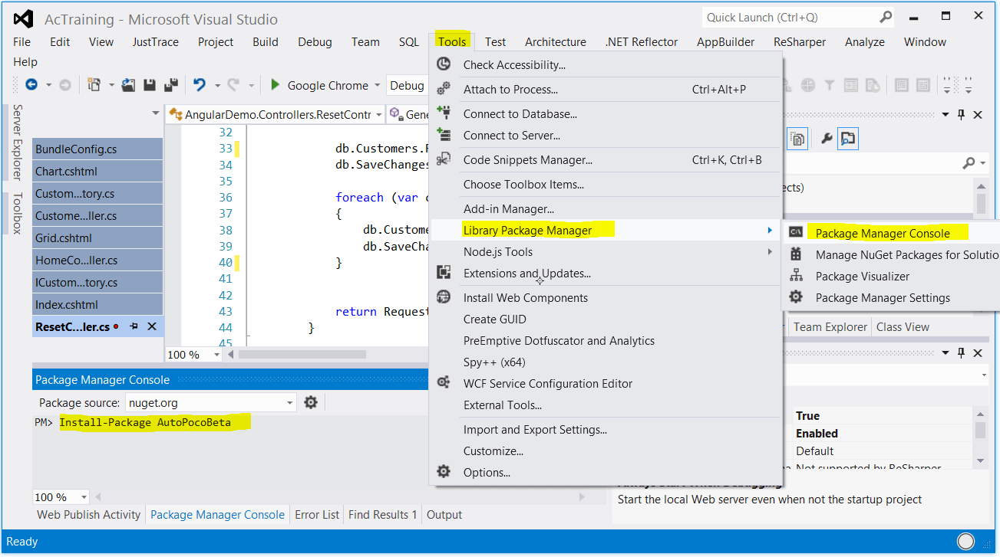

# Fünftägiger ASP.NET MVC Workshop
Ihr Trainer: [Johannes Hoppe](http://www.haushoppe-its.de) von der [conplement AG](http://www.conplement.de/)

## Tag 3 - Agenda

1. [Vorbereitung](#vorbereitung)
2. [OData](#odata)
3. [Kendo UI](#kendo)
4. [JavaScript Best Practices](#javascript)


<a name="vorbereitung"></a>
## 1. Vorbereitung


Es gibt eine neue Klasse Namens ResetController für bessere Demo-Daten.
Fehlende Nuget Pakete:  
`PM> Install-Package AutoPocoBeta`
`PM> Install-Package AutoPoco.DataSources`





<a name="odata"></a>
## 2. OData

Der bestehende Web API Controller kann durch ein paar Änderungen um die Funktionalität von OData ergänzt werden. Der Controller muss hierzu vom "ODataController" erben. Es ist notwendig, dass die Funktionalität per `[EnableQuery]` explizit freigeschaltet wird. Wir ändern die CustomersController wie folgt ab:

~~~~~
public class CustomersController : ODataController
{
    private DataContext db = new DataContext();

    // GET: odata/Customers
    [EnableQuery]
    public IQueryable<Customer> GetCustomers()
    {
        return db.Customers;
    }

    /* [...] */
}
~~~~~

Anschließend ist es erforderlich die Klasse `WebApiConfig` zu konfigurieren. Mittels `config.Routes.MapODataRoute` legt man fest, unter welcher Adresse der "root" des OData Service zu finden ist. Alle Beispiele von Microsoft verwenden die Adresse "/odata", welche sich von der Adresse "/api" für normale ASP.NET Web API Aufrufe unterscheidet.  

~~~~~
public static class WebApiConfig
{
    public static void Register(HttpConfiguration config)
    {
        ODataConventionModelBuilder builder = new ODataConventionModelBuilder();
        builder.EntitySet<Customer>("Customers");
        builder.EntitySet<Invoice>("Invoices");
        config.Routes.MapODataServiceRoute("odata", "odata", builder.GetEdmModel());
    }
}
~~~~~

OData gibt die Namen der Query-Parameter mit einer Sammlung von Konventionen exakt vor, so dass die Verwendung eindeutig wird. Die notwendigen Parameter für Paging heißen `$top` und `$skip`. `$top` gibt *n* Elemente der Ergebnismenge zurück. `$skip` überspringt *n* Elemente in der Ergebnismenge. Möchte man z.B. die Kunden mit der fortlaufenden Nummer 3 bis 7 abrufen, so verwendet man folgenden Aufruf:

~~~~~
GET http://example.org/odata/Customers?$top=5&$skip=2
~~~~~

Weitere Query-Parameter sind unter anderem `$filter`, `$orderby`, `$inlinecount`, `$count` (nicht supported in v3) oder `$search`. 

### Beispiele
* Metadaten Dokument abrufen: **/odata/$metadata**
* Paging: /odata/Customers?$top=5&$skip=2
* Paging mit Count: /odata/Customers?$top=5&$skip=2&$inlinecount=allpages
* Filtern: /odata/Customers?$filter=FirstName eq 'Hans'

### Hinweis:

Es erscheint eine Fehlermeldung "BigCount is not a not supported DbFunctionAggregate".
Dies begründet sich durch eine fehlende Implementierung der Funktionaliät in Effort.
Workaround:

```
public class CustomerRepository : ICustomerRepository
{
    public IQueryable<Customer> GetCustomers()
    {
        // bugfix to support the count, even when using Effort!
        return _dataContext.Customers.ToList().AsQueryable();
    }
}
```


<a name="kendo"></a>
## 3. Kendo UI

Der Controller unterstützt nun eine seitenweise Ausgabe, Sortierung und Filterung. Diese Fähigkeiten direkt mit AngularJS umzusetzen wäre ein großer Aufwand. Es bietet sich an, ein fertiges Tabellen-Control ("Grid") zu verwenden. Auf dem Markt finden sich eine Reihe von freien und proprietären Grids, welche mit AngularJS kompatibel sind. Ein bekanntes und weit verbreitetes Framework ist Kendo UI von Telerik:

http://demos.telerik.com/kendo-ui/grid/index

### Integration in die Anwendung

1. Nuget Paket: "Kendo UI Professional"
2. Anpassung BundleConfig
3. Einbinden in @section scripts

```
public static void RegisterBundles(BundleCollection bundles)
{
    bundles.Add(new ScriptBundle("~/bundles/jquery").Include(
                "~/Scripts/jquery-{version}.js",
                "~/Scripts/kendo/2014.2.716/kendo.all.min.js"));

    /* [...] */

    bundles.Add(new StyleBundle("~/Content/css").Include(
              "~/Content/bootstrap.css",
              "~/Content/site.css",      
              "~/Content/kendo/2014.2.716/kendo.common-bootstrap.min.css",
              "~/Content/kendo/2014.2.716/kendo.bootstrap.min.css"));
}

```

**Hinweis**: Die verwendete Kendo UI Version geht von OData v2 aus.
Bei einem OData v3 Endpunkt muss die Datasource wie folgt angepasst werden. (data und total wurden korrigiert)

```js
var dataSource = new kendo.data.DataSource({
    type: 'odata',
    transport: {
        read: {
            type: 'GET',
            url: '/odata/Customers',
            dataType: 'json'
        }
    },
    schema: {
        data: function (data) { return data.value; },
        total: function (data) { return data['odata.count']; },
        model: {
            id: 'Id',
            fields: {
                Id: { type: 'number' },
                FirstName: { type: 'string' },
                LastName: { type: 'string' },
                Mail: { type: 'string' },
                DateOfBirth: { type: 'date' }
            }
        }
    },
    serverPaging: true,
    serverSorting: true,
    serverFiltering: true,
    pageSize: 10
});

```

### Aufgaben:

1. Fügen Sie Kendo UI per Nuget zum Projekt hinzu
2. Implementieren Sie ein Grid mit Kendo UI
3. Pimpt das grid mit einer Filter Row!
3. Implementieren Sie ein Chart mit Kendo UI


<a name="javascript"></a>
## 4. JavaScript Best Practices


### http://johanneshoppe.github.io/JsBestPractices/

<hr>

_&copy; 2015, Johannes Hoppe_
