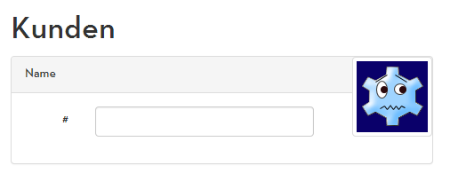
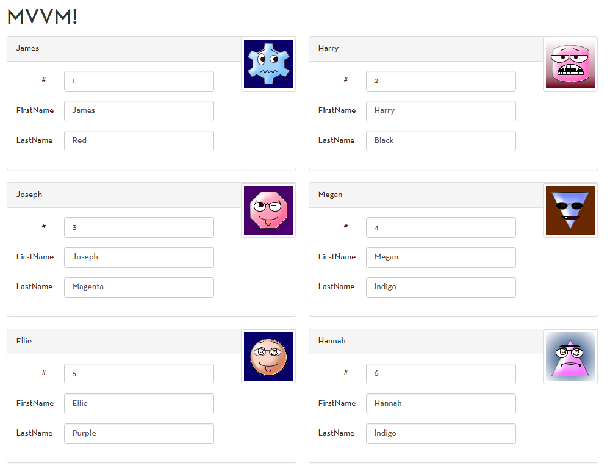
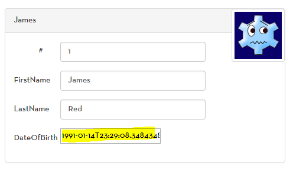
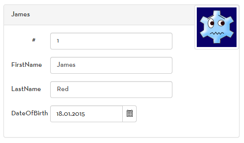

# Fünftägiger ASP.NET MVC Workshop
Ihr Trainer: [Johannes Hoppe](http://www.haushoppe-its.de) von der [conplement AG](http://www.conplement.de/)

## Tag 4 - Agenda

1. [JavaScript Best Practices](#javascript)
2. [Knockout.js](#knockout)
    1. [Just Plain HTML](#plain)
    2. [Bootstrapping Knockout](#bootstrapping)
    3. [Fetching data from the Server](#data)
    4. [Applying Bindings](#bindings)
    5. [Custom Bindings](#custom)

<a name="javascript"></a>
## 1. JavaScript Best Practices


### http://johanneshoppe.github.io/JsBestPractices/


Johannes 4 goldene Regeln für Modulares JavaScript:
1. Namespaces
2. Immediate functions
2. Private and public members 
3. Abhängigkeitsmanagement

Zutaten:
1. Immediate Funktionen: `(function() {})()`
2. [Revealing Module Pattern](http://addyosmani.com/resources/essentialjsdesignpatterns/book/#revealingmodulepatternjavascript)


<a name="knockout"></a>
## 2. Knockout.js

### Nuget Packages:

```
PM> Install-Package knockoutjs
PM> Install-Package Knockout.Mapping
```
Die BundleConfig nicht vergessen:

```
bundles.Add(new ScriptBundle("~/bundles/jquery").Include(
    "~/Scripts/jquery-{version}.js",
    "~/Scripts/kendo/2014.2.716/kendo.all.min.js",
    "~/Scripts/knockout-{version}.js",
    "~/Scripts/knockout.mapping-latest.debug.js",
    "~/Scripts/app/*.js"
));
```

<a name="plain"></a>
### 2.1 Just Plain HTML

One of the biggest advantages of Knockout is the ability to directly use HTML elements. No ASP.NET user controls or heavy-loaded vendor-specific controls are required. Just good-old plain HTML:

```
<div id="index_template">

    <h1>Kunden</h1>
    
    <div>
        
        <div class="panel panel-default pull-left col-md-5 " style="padding:0; margin-right: 20px;">

            
            <div class="panel-heading">Name</div>
            <div class="panel-body">

                <form class="form-horizontal">

                    <div class="form-group">

                        <label class="col-sm-2 control-label">#</label>
                        <div class="col-sm-7">
                            <input type="text" class="form-control">
                        </div>

                    </div>

                </form>
            </div>
        </div>
    </div>
    
    <br style="clear: both;">

</div>
```

Which looks like:



<a name="bootstrapping"></a>
### 2.2 Bootstrapping Knockout

A typical **MVVM** driven-website has three team players:

1. The model, which usually represents some business data and business logic. In our case the model "lives" in the C# world on the server side. Subsets of the data can be serialized to JSON and will be sent over the wire with the help of the ASP.NET Web API.
2. The view, it is built with plain HTML and some extra HTML5 data attributes that help Knockout to do its job.
3. The ViewModel, which glues everything together. The ViewModel is responsible for talking into both "worlds". It represents a part of the full model data, eg. one product or a paged list of products. This data can be bound to the HTML so that the data gets visible. The ViewModel also exposed all methods that the view should call to operate on the model / business data.


```js
@section scripts {
    <script>
        var model = new CustomerViewModel();
        ko.applyBindings(model, $('#index_template').get(0));
        model.loadData();
    </script>
}
```


<a name="data"></a>
## 2.3 Fetching data from the Server

Our first view model will be simple, it just loads some data and stores the content into its own property "customers". 

```javascript
var CustomerViewModel = function () {

    var self = this;

    self.header = ko.observable("MVVM!");
    self.customers = ko.observableArray([
        {
            Id: ko.observable(0),
            FirstName: ko.observable("Daten laden..."),
            LastName: ko.observable("werden geladen..."),
            DateOfBirth: ko.observable(new Date())
        }]);

    self.loadData = function () {

        $.get('/odata/Customers?$top=10')
            .success(function (data) {
                self.customers = ko.mapping.fromJS(data.value, {}, self.customers);
            });
    };
};
```

Loading data should be encapsulated within the ViewModel itself. We start with an empty ViewModel and apply that empty ViewModel to the HTML. One of the biggest benefits is the subscriber / observer pattern for all ViewModels in Knockout. As soon as the ViewModel changes, the HTML will change, too. So we are save to ask the model to load its data after the initial binding. As soon as we get data, the HTML will show it.

The initial empty data is created with ko.observable and ko.observableArray. LoadData triggers jQuery to load data via GET.

After the JSON data returns from the server, jQuery will parse it and provide an object (called `data` here), that holds all the data. To save some time, we use the [Knockout Mapping](http://knockoutjs.com/documentation/plugins-mapping.html) plugin. It will update the observableArray with the fresh JSON data. Knockout will now render a second time.


<a name="bindings"/></a>
## 2.4. Applying Bindings

A test with the browser will show that the page does absolutely nothing. The list is still totally empty. This effect is by design. Knockout will not guess were to apply the ViewModel data. We will add some [HTML5-compatible declarations](http://www.w3.org/TR/2010/WD-html5-20101019/elements.html#embedding-custom-non-visible-data-with-the-data-attributes) to the html!

The most simple binding is the "text" binding. It just adds a text-child to the given HTML-DOM element. Knockout will check, if the ViewModel has a property that is called "Title", "Message" and so on. If a property exists, it will been called as a function. 


```
<h1 data-bind="text: header">Kunden</h1>
```

### Aufgabe: Experimentiere mit den verschiedenen Bindings, um folgenden Screen zu erhalten:



Erforderlich:
* `text`
* `foreach`
* `attr`
* ggf. `textInput`


<a name="custom"/></a>
## 2.5. jQuery Plugins integrieren / custom bindings

jQuery-Plugins werden üblicherweise in dem Zeitpunkt angewendet, wenn der DOM bereit steht, z.B. per:
```
$(function() {
    $(".datepicker").kendoDatePicker();
});
```

Zu diesem Zeitpunkt hat aber Knockout noch gar nicht das HTML gerendert. Es geschieht demnach nichts:



Auch würde jede Änderung am Observable-Array die Manipulation des jQuery-Plugins wieder verwerfen. Generell gilt: **In Knockout sollte jeder Code, der den DOM manipuliert, durch ein "[Custom Binding](http://knockoutjs.com/documentation/custom-bindings.html)" realisiert werden.** Dies gilt ebenso für jQuery-Plugins!

```
<input type="text"
       class="datepicker"
       data-bind="textInput: DateOfBirth,
                  my_kendo_datepicker: { format: 'dd.MM.yyyy' }">


<script>

    ko.bindingHandlers.my_kendo_datepicker = {
        init: function (element, valueAccessor) {
            var options = valueAccessor() || {};
            $(element).kendoDatePicker(options);
        }
    };

</script>

```
Ergebnis:



Allerdings berücksichtigt in diesem Fall das Kendo UI-Widget nicht das ViewModel von Knockout. Das heißt, es wird weder eine Änderung im ViewModel im Kendo UI-Widget angezeigt, nocht wird eine Änderung im Kendo UI-Widget zurück an das ViewModel kommuniziert. Die vollständige Integration beider Welten ist sehr aufwendig.

```
<input type="text"
       class="datepicker"
       data-bind="my_kendo_datepicker2: DateOfBirth,
                  datepickerOptions: { format: 'dd.MM.yyyy' }">

<script>

   ko.bindingHandlers.my_kendo_datepicker2 = {
        init: function(element, valueAccessor, allBindingsAccessor) {

            //initialize datepicker with some optional options
            var options = allBindingsAccessor().datepickerOptions || {};
            var datepicker = $(element).kendoDatePicker(options).data('kendoDatePicker');

            // populate changes from Kendo UI world to Knockout world
            datepicker.bind("change", function() {

                var value = datepicker.value();
                var observable = valueAccessor();

                if (value === observable()) {
                    return;
                }

                console.log("change in Kendo UI", value);
                observable(value);
            });

            //handle disposal (if KO removes by the template binding)
            ko.utils.domNodeDisposal.addDisposeCallback(element, function() {
                datepicker.destroy();
            });
        },

        update: function (element, valueAccessor) {

            //update the control when the view model changes
            var value = ko.utils.unwrapObservable(valueAccessor());
            var datepicker = $(element).data('kendoDatePicker');

            if (value === datepicker.value()) {
                return;
            }

            console.log("change in Knockout", value);
            datepicker.value(value);
        }
    }

</script>

```

Telerik hat bereits eine Sammlung von fertigen Knockout-Bindings vorbereitet:
https://github.com/kendo-labs/knockout-kendo


Siehe auch:
http://www.knockmeout.net/2011/07/another-look-at-custom-bindings-for.html

<hr>

_&copy; 2015, Johannes Hoppe_
