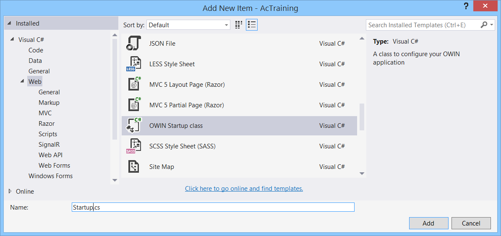
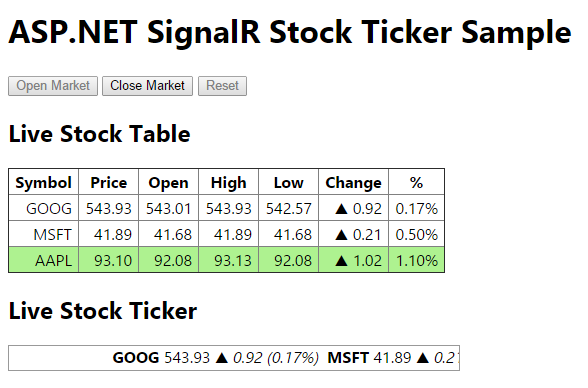
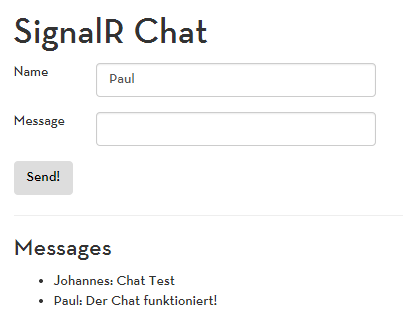
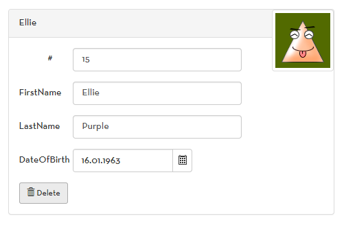
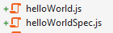
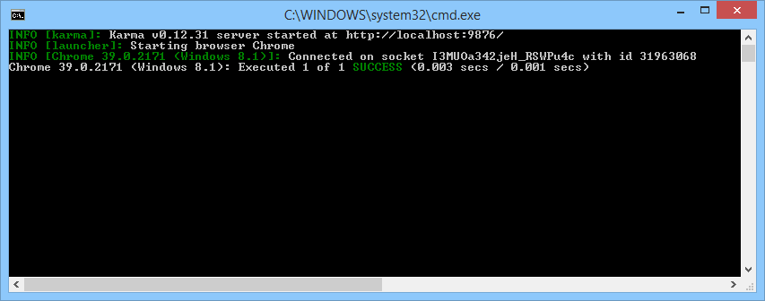
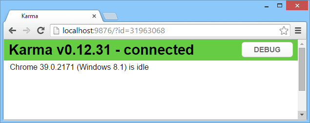

# Fünftägiger ASP.NET MVC Workshop
Ihr Trainer: [Johannes Hoppe](http://www.haushoppe-its.de) von der [conplement AG](http://www.conplement.de/)

## Tag 5 - Agenda

1. [SignalR](#signalr)
    1. [Installation und Beispielanwendung](#installation)
    2. [SignalR Chat](#chat)
    3. [Kunde löschen mit Broadcast](#customer)
2. [JavaScript Unit-Tests](#unittest)
    1. [Einführung in Jasmine](#jasmine)
    2. [Verwendung von Karma](#karma)


<a name="signalr"></a>
## 1. SignalR

SignalR ist ein Framework, welche eine bidirektionale Kommunikation zwischen Client und Server ermöglicht. Je nachdem, welche Technologien vorhanden sind, verwendet SignalR Long Polling, Server-Sent Events oder Websockets. Welche Technologie verwendet wird, verhandeln Server und Client beim Verbindungsaufbau. Weiterhin überwacht das Framework den Verbindungsstatus und baut bei Abbruch eine Verbindung erneut auf. Das Framework enthält einen **Messaging Bus**, der Nachrichten zwischen Server und mehreren Clients sicher übermittelt.

<a name="installation"></a>
### 1.1 Installation und Beispielanwendung

    Install-Package Microsoft.Owin -Version 3.0.0
    Install-Package Microsoft.Owin.Security -Version 3.0.0
    Install-Package Microsoft.AspNet.SignalR -Version 2.2.0
    

SignalR Beispielanwendung

    Install-Package Microsoft.AspNet.SignalR.Sample -Version 2.2.0

Jede OWIN Anwendung benötigt eine "Startup Class". In Visual Studio existiert ein entsprechendes Template:



Um SignalR zu konfigurieren, muss der Inhalt dieser Datei wie folgt lauten:

```
using Microsoft.Owin;
using Owin;

[assembly: OwinStartup(typeof(AcTraining.Startup))]
namespace AcTraining
{
    public class Startup
    {
        public void Configuration(IAppBuilder app)
        {
            app.MapSignalR();
        }
    }
}
```

Danach kann das Beispiel unter
    /SignalR.Sample/StockTicker.html
betrachtet werden.





<a name="chat"></a>
### SignalR Chat

Am einfachsten kann man SignalR verwendet, wenn man von "Hubs" implementiert. Die Grundlage bildet eine C#-Klasse, die von "Hub" erbt. Auf Client-Seite kann dann eine automatisch generiertes JavaScript verwendet werden, welches unter der Adresse **"/signalr/hubs"** zu finden ist.   

```
public class ChatHub : Hub
{
    public void Send(string name, string message)
    {
        Clients.All.broadcastMessage(name, message);
    }
}
```

Die BundleConfig muss erneut angepasst werden:

```
bundles.Add(new ScriptBundle("~/bundles/jquery").Include(
            "~/Scripts/jquery-{version}.js",
            "~/Scripts/jquery.signalR-{version}.js" // NEU
            // ... weitere
            );

```

Die Adresse **"/signalr/hubs"** muss leider manuell hinzugefügt werden:

```
@Scripts.Render("~/bundles/jquery")
<script src="~/signalr/hubs"></script>

```

Anschließend steht die Methode `send` im Client zur Verfügung:

```
var ChatViewModel = function () {

    var self = this;
    var chatHub = $.connection.chatHub;
    
    self.name = ko.observable();
    self.message = ko.observable();
    self.messages = ko.observableArray();

    self.sendMessage = function() {
        chatHub.server.send(self.name(), self.message());
        self.message("");
    }

    chatHub.client.broadcastMessage = function (name, message) {

        self.messages.push({
            name: name,
            message: message
        });
    };

    $.connection.hub.start().done(function() {
        console.log("chat started!");
    });
};
```

### Aufgabe: Implementiere eine Oberfläche für dieses View-Model, Beispiel:




<a name="customer"></a>
### Kunde löschen mit Broadcast

Im Hauptverzeichnis des Projektes befindet sich ein vorbereiteter OData-Controller ``Customers2Controller`.
Dieser implementiert alle CRUD Operationen der entsprechend der URL Konventionen. Es ist z.B. mit folgenden Befehl möglich, einen Datensatz zu löschen:

```
    self.deleteCustomer = function(customer) {
    
        $.ajax({
            url: '/odata/Customers2(' + customer.Id() + ')',
            type: 'DELETE',
        });
    }

```

Wenn nur Daten vom Server zu Client gesendet werden sollen, muss kein Code im Hub implementiert werden:

```
public class CustomerHub : Hub
{
}
````

Es können beliebige JavaScript Befehle mittels des "dynamic" Datentyps aufgerufen werden:

```
public class Customers2Controller : ODataController
{
    // DELETE: odata/Customers2(5)
    public IHttpActionResult Delete([FromODataUri] int key)
    {
        /* [...] */

        var context = GlobalHost.ConnectionManager.GetHubContext<CustomerHub>();
        context.Clients.All.customerDeleted(key);

        /* [...] */
    }
}

```

Auch auf dieses Event kann man sich registrieren:
```
var customerHub = jQuery.connection.customerHub;

customerHub.client.customerDeleted = function (customerId) {

    self.customers.remove(function(customer) {
        return customer.Id() == customerId;
    });
};

$.connection.hub.start().done(function () {
    console.log("customer connection started!");
});
```

### Aufgabe: Implementiere eine Oberfläche, welche bei Klick auf dem Löschen-Button den Datensatz entfernt. Der Eintrag soll auf allen verbundenen Clients sofort entfernt werden.




Mehr Informationen zu SignalR finden sich in der Dokumentation auf [http://www.asp.net/signalr](http://www.asp.net/signalr).


<a name="unittest"></a>
## 2. JavaScript-Code mit Karma und Jasmine testen

<a name="jasmine"></a>
### 2.1 Einführung in Jasmine


http://johanneshoppe.github.io/JsBestPractices/#/5

<a name="karma"></a>
### 2.2 Verwendung von Karma

Um Unit-Tests für JavaScript zu schreiben, verwendet man am Besten einen so genannten Test-Runner. Empfehlenswert ist der Test-Runner "Karma", welcher von Google entwickelt wurde. Das Tool basiert auf Node.js und läuft somit auf allen gängigen Betriebssystemen. Erwähnenswert ist die Tatsache, dass Karma einen eigenen Webserver startet und dann einen echten Browser (z.B. den Internet Explorer, Firefox und Chrome) die JavaScript-Dateien ausführen lässt. Der eigene Webserver zeichnet Karma aus und vermeidet technische Probleme, die man bei der Ausführung per lokalem Dateisystem hätte. 

Die Installation von Karma ist sehr einfach. Es ist zunächst notwendig, Node.js zu installieren damit der Befehl "npm" befehlt zur Verfügung steht. Man kann, wie auf der Website von Karma beschrieben, den Test-Runner und alle Plugins per Kommandozeilenbefehl installieren. Komfortabler und vor allem reproduzierbarer ist es jedoch, eine Datei namens `package.json` in das gewünschte Verzeichnis zu legen. Danach lassen such durch den Befehl `npm install` alle notwendigen Dateien herunter laden:

##### package.json zur Installation von Karma 
~~~~~
{
    "name" : "karma-testrunner-and-depedencies",
    "version" : "1.0.0",
    "description" : "Installs Karma Testrunner and dependencies",
    "dependencies" : {
        "karma": "~0.12.31",
        "karma-jasmine": "~0.3.3",
        "jasmine-core": "~2.1.3",
        "karma-requirejs": "~0.2.2",
        "karma-chrome-launcher": "~0.1.4",
        "karma-ie-launcher": "~0.1.5",
        "karma-cli": "~0.0.4"
    },
    "private": true
}
~~~~~

Anschließend benötigt das Projekt eine Konfigurationsdatei, welche den standardmäßig Namen `karma.conf.js` trägt. Der Befehl `karma init` startet ein Kommandozeilen-Dialog, welcher bei der Erstellung der Datei hilft. In den letzten beiden Artikeln der Serie wurden alle JavaScript-Dateien im AMD-Format definiert, entsprechend ist das Plugin `karma-requirejs` zum Laden der Dateien notwendig. Durch die Verwendung von require.js benötigt man lediglich eine spezielle Konfigurations-Datei, welche hier `require.config.karma.js` genannt wird.

##### karma.conf.js zur Konfiguration von Karma 
~~~~~
module.exports = function(config) {
    config.set({

        basePath: 'AC_Training/Hoppe/AcTraining/Scripts',
        frameworks: ['jasmine', 'requirejs'],
        files: [
            'require.config.karma.js',
            { pattern: '**/*.js', included: false }
        ],
        browsers: ['Chrome']
    });
};
~~~~~

Mit der Datei `require.config.karma.js` werden vor allem Pfade und so genannte "Shims" für die Abwärtskompatibel festgelegt. Während zum Beispiel der Standardpfad für JavasScript-Dateien in einer ASP.NET MVC Anwendung `/Scripts` lautet, wird in der Karma-Welt stets der Ordner `/base` verwendet (siehe `baseUrl`).   

##### require.config.karma.js zur Konfiguration des Modul-Loaders require.js 
~~~~~
requirejs.config({
    
    baseUrl: '/base', // !!!
    
    paths: {
        'jquery': 'jquery-1.10.2',
        'kendo': 'kendo/2014.2.716/kendo.all.min'
    },
    shim: {
        kendo: { deps: ['jquery'] }
    },
    deps: (function() {

        var allTestFiles = [];

        Object.keys(window.__karma__.files).forEach(function(file) {
          if (/Spec\.js$/.test(file)) {
            allTestFiles.push(file.replace(/^\/base\//, '').replace(/\.js$/, ''));
          }
        });
            
        return allTestFiles;
    })(),
    callback: window.__karma__.start
});


~~~~~

Es bietet sich an, eine Konvention für die Dateinamen der Test-Dateien zu verwenden. Wenn das zu testende AMD-Modul `helloWorld` heißt, so sollte man am Besten das Modul für den Unit-Test `helloWorldSpec` zu nennen:


##### Konvention für die Benennung der Test-Module


Da der Name des AMD-Moduls und der Dateiname (ohne Dateiendung) gleich sind, kann man die globale Variable `window.__karma__.files` nach Einträgen mit der Endung "Spec.js" durchsuchen, die Dateiendung entfernen und anschließend alle Module per require.js laden. Dies geschieht in der Funktion die beim Konfigurations-Eintrag `deps` angegeben wurde.      

Es fehlt noch ein Test-Framework, welches idealerweise eine vergleichbare BDD-Syntax wie MSpec besitzt. Diese Syntax bietet das Test-Framework Jasmine. Das folgende Script definiert einen Test, welcher das simple AMD-Modul `helloWorld` testet:

##### helloWorld.js mit dem AMD-Modul "helloWorld"
~~~~~
define([], function () {

    return {
        say: function() {
            return "Hello World";
        }
    }
});
~~~~~ 


##### helloWorldSpec.js mit dem AMD-Modul "helloWorldSpec"
~~~~~
define(['helloWorld'], function(helloWorld) {

    describe('helloWorld', function () {
        it('should say hello', function() {
            expect(helloWorld.say()).toEqual("Hello World");
        });
    });

});
~~~~~ 

Der `define`-Befehle kennzeichnet das AMD-Format. Der Test selbst lädt das zu testende Modul als Abhängigkeit nach. Neu sind die Befehle "describe", "it", "expect" und "beforeEach" welche von Jasmine gestellt werden. Mittels des Befehls `karma start` lässt sich nun dieser erste JavaScript Unit-Test ausführen. Das Ergebnis des Unit-Tests wird auf der Kommandozeile ausgegeben. Es öffnet sich ebenso ein Browser, der die Entwicklung und die Fehlersuche in einem Test in einer gewohnten Debugging-Umgebung ermöglicht.  



##### Ein erfolgreicher Test mit dem Karma-Testrunner

<hr>

_&copy; 2015, Johannes Hoppe_
